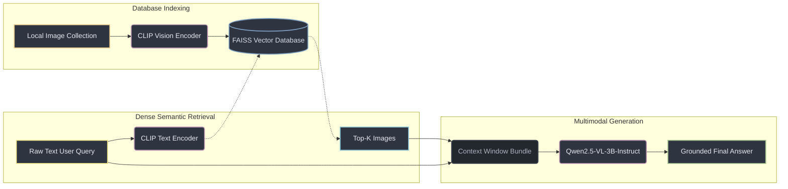

# Visual Archive


`varch` is a lightweight, fully local, multimodal RAG system designed to let you query your local image galleries using natural language. 

By combining dense semantic vector search via **CLIP** with a fine grained Vision Language Model **Qwen2.5-VL-3B-Instruct**, `varch` allows you to locate visual attributes, activities, and text context across your image database entirely offline without leaking data to external cloud APIs.

---

## Pipeline Overview

`varch` implements a streamlined, lightweight pipeline that leverages the natural joint latent space of CLIP paired with the visual reasoning of Qwen2.5-VL:



**Database Indexing:** Local image collections are processed entirely offline through a **CLIP Vision Encoder** to generate dense visual embedding vectors, which are then indexed inside a high-performance **FAISS** vector database.

**Dense Semantic Retrieval:** The raw natural language user query is passed directly into the **CLIP Text Encoder**. A fast similarity search is then executed against the FAISS index to retrieve the top-$K$ visual matches.

**Multimodal Generation:** The retrieved images and the original user query are bundled into a structurally guarded prompt context window and passed to **Qwen2.5-VL-3B-Instruct** to synthesize the final, grounded answer.

---

## Features

* **100% Connection Free:** Runs fully local with zero external API calls, ensuring complete privacy and offline availability.

* **Flexible Hardware Support:** Supports both GPU and CPU execution. 
    * **GPU:** Features pre-configured **4-bit quantization** (via BitsAndBytes) to run efficiently on resource-constrained consumer cards with low VRAM (6GB/8GB).
    * **CPU:** Fully supported for systems without a dedicated graphics card.

* **Streamlined CLI:** A power-packed, interactive command-line interface that supports direct terminal commands and includes structured documentation.

---

## Installation & Setup

### 1. Prerequisites
- Ensure you have Python 3.12+. 
- CUDA-compatible environment configured (higly recommanded).

### 2. Installation
```bash
git clone https://github.com/yuvalrubinil/VisualArchive
cd VisualArchive
python -m venv .venv
source .venv/bin/activate
pip install -e .
```

### 3. Usage & Command Reference

The toolkit exposes a global unified entry point `varch` through your terminal. Below is the detailed reference of all supported commands, arguments, and options derived from the core application source.

### Commands Summary

| Command | Action | Arguments |
| :--- | :--- | :--- |
| [`status`](#1-varch-status) | Checks hardware backend, database health, and model cache status. | None |
| [`init`](#2-varch-init) | Pre-downloads and verifies the required weights for local execution. | None |
| [`observe`](#3-varch-observe) | Processes a folder of images and commits embeddings into the vector DB. | `PATH` |
| [`search`](#4-varch-search) | Spawns an interactive shell prompt session for semantic retrieval. |`-k`, `--fr` |

---

### Command Details & Parameters

#### 1. `varch status`
Inspects your environment variables, checking whether execution defaults to hardware accelerated `cuda` or `cpu` backends. It scans local Hugging Face directories to verify cached model binaries (`open-clip` and `qwen-vl`) and ensures index mapping components are intact.

  ```bash
  varch status
  ```


#### 2. `varch init`
Triggers sequential caching operations for required baseline layers. It pulls both tokenizers and model backbones down to the internal storage directories (HF_HUB_CACHE) so the toolkit can run in entirely isolated environments.

  ```bash
  varch init
  ```

#### 3. `varch observe`
Scans a target directory, processes your image archive using latent feature extraction layers, and updates local database instances.

* **Arguments:**
  * `PATH` *(Text, Required)*: Position argument denoting the relative or absolute path pointing to the target image folder.

```bash
varch observe /path/to/image/folder
```

#### 4. `varch search`
Launches an ongoing interactive session inside your terminal to find visuals via natural language. Type queries continuously; input `~terminate` to safely break out and exit the execution thread.

* **Arguments:**
  * `-k` (Integer, Default: 5): Sets the limit threshold for the total number of nearest-neighbor matches retrieved.
  * `--fr` (Flag, Default: False): Enables Fast Retrieval mode. Activating this flag bypasses heavy visual language reconstruction steps (skipping VLM weights decoding logic entirely) to provide pure vector lookup speeds across embeddings.

```bash
varch search -k 3 --fr
```